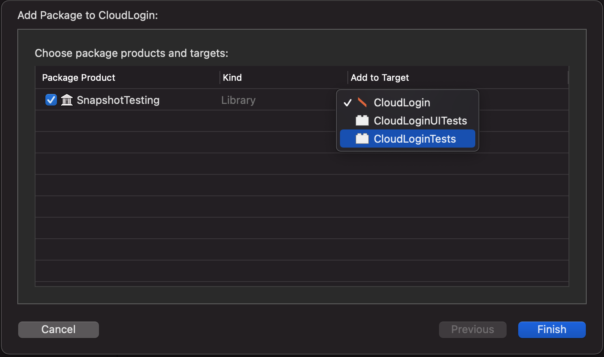
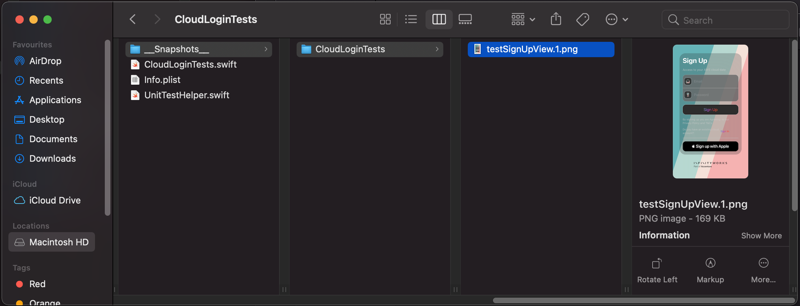
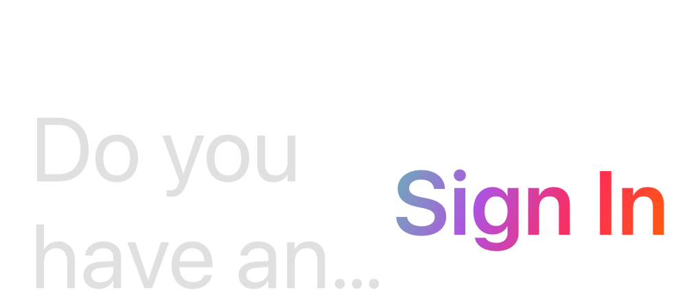
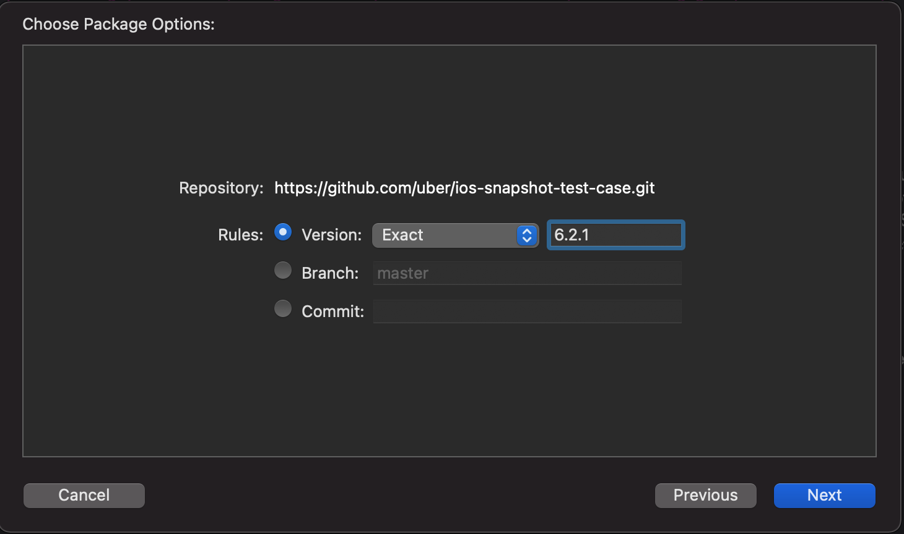
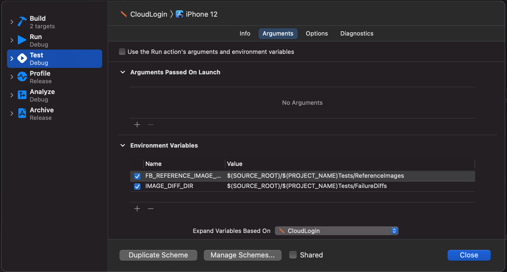

# Snapshot UI Testing

> ### 📝 **_TLDR:_**
> _Use Swift Snapshot and assert anything not just images. iOSSnapshotTestCase still works but currently not actively maintained, only in the form of a community derived fork._
> 
## SnapshotTesting

SnapshotTesting allows the addition of snapshotting text and other types not limited to just images. To snapshot  test a image first import the library to your test case target.

### Dependecies:
[SnapshotTesting - Delightful Swift snapshot testing ](https://github.com/pointfreeco/swift-snapshot-testing.git)

include SnapshotTesting to your project via Swift Package Manager from the following repo [https://github.com/pointfreeco/swift-snapshot-testing.git](https://github.com/pointfreeco/swift-snapshot-testing.git)

```
dependencies: [
.package(name: "SnapshotTesting", url: "https://github.com/pointfreeco/swift-snapshot-testing.git", from: "1.8.1"),
]
```

If importing to Xcode via SPM, you must enusre you apply it to your test target only. Select your Unit Test test target and hit continue. Once the library is imported there are no further configuration steps needed.



Add the SnapShot test library to your Unit test class via `@import SnapshotTesting` , add a testable import of your project `@testable import CloudLogin` and since `CloudLogin is a SwiftUI project, we will also import the SwiftUI package.

```
import XCTest
import SwiftUI
import SnapshotTesting
@testable import CloudLogin

class CloudLoginTests: XCTestCase {
```

### Running your first SnapshopTest

Creat a snapshot of your app screen by first loading the View and recording the screen. This is done by setting a global attribute `isRecording` to true.

You can set this up in the `setUpWithError()` function of the test to control it globally for the Unit test class.  You can also set `isRecording` at the function level or the individual assertion as a optional parameter.

> _Replace all snapshot images for each assertSnapshot in your test class_
```
override func setUpWithError() throws {
    isRecording = true
}
```
> _replace at the function level_
```
func testExample() -> throws {
    var sut = SignupScreenView()
    isRecording = true
}
```
> _assertion level_

```
assertSnapshot(matching: viewController, as: .image(on: .iPhoneSe), record: true )
```

There isn't any thing further to test at this point as your test will always fail when isRecording is test to true. The framework will also throw a error remidning you to turn this off for running test.

After running with `isRecording = true` a __**Snapshots**__ folder is generated at the path of your test file.



Set isRecording to false and assert your view using assertSnapshot with the assertion strategy type of  `image`.

learn more about assertion strategies here -> [Assertion strategy documentation](https://github.com/pointfreeco/swift-snapshot-testing/blob/main/Documentation/Available-Snapshot-Strategies.md)

> _When creating a new snapshot verify the image is correct before proceeding._
> _Due to the nature of snapshot testing a 'true' result will be the initally recorded image captured, if this is incorrect to begin with all future assertion will be falsely identified as passing._

A handy feature of the image assertion strategy is the ability to render for a specific device size, this is done by using the optional paramerter `on` when defining the assertion strategy type.

```
assertSnapshot(matching: viewController, as: .image(on: .iPhoneSe))
```

You are able to also snapshot test a particular reference size of your image. 

From the results of our accessibility test `testAccountContextSwitchAccessibilitySizes`, we can see that our design needs to address large accessibility fonts. 

 - accessibilityExtraExtraExtraLarge
 - accessibilityExtraExtraLarge
 - accessibilityExtraLarge
 - accessibilityLarge


If we remove isRecording,true for the accessibility sizes we risk introducing false positives into our testing suite. The optional record parameter will remain on the accessibility tests so it continues to fail untill correctly adjusted for the view.

## iOSSnapshotTestCase

### Background:
[iOSSnapshotTestCase](https://github.com/uber/ios-snapshot-test-case/)

Originally developed by Facebook, iOS Snapshot Test Case allowed assertion of your UI during  XCTUITest by comparing a screenshot of your app. The ownership of the repo then passed to Uber however it is no longer maintained by Uber. One of the top contributers [@alanzeino](https://github.com/alanzeino) who help facillate Uber taking ownership of iOS Snapshot Test Case from facebook. Ironically he's no longer at Uber and works for FB has pointed many users to the SnapshotTesting repo. Additionally there are further community changes needed to allow iOS Snapshot Test Case to run in Xcode 12, `@alanzeino` has stated he is attempting to gain ownership to the repo. A working fork of iOS Snapshot Test Case can be found on his github [iOS Snapshot Test Case - active fork](https://github.com/alanzeino/ios-snapshot-test-case).

### Installing:
Implementing snapshot testing with iOSSnapshotTestCase. Add the dependency `https://github.com/alanzeino/ios-snapshot-test-case.git` to SPM via xcode or directly in the Packages.swift file.



```
dependencies: [
.package(url: "https://github.com/uber/ios-snapshot-test-case.git", .exact("6.2.1")),
]
```

After including the library you must configure it as it is a Linked library as your project will fail to compile until you do. 

As per the documentation you must define and include the following enviornment variables `FB_REFERENCE_IMAGE_DIR` and `IMAGE_DIFF_DIR` in the `Test` phase of your projects scheme and select your project from the drop down box for 'Expand Variables Based On'
>Edit Scheme -> Test -> Arguments -> Environment Variables

| Name | Value |
| :------- | :------- |
| FB_REFERENCE_IMAGE_DIR | \$(SOURCE_ROOT)/$(PROJECT_NAME)Tests/ReferenceImages |
| IMAGE_DIFF_DIR | \$(SOURCE_ROOT)/$(PROJECT_NAME)Tests/FailureDiffs |



Next create a test that extends from `FBSnapshotTestCase` instead of  `XCTest`, FBSnapshotTestCase requires that you call the `super.setup()` as per OOP principles but this means that you must use the `overrided func setup` instead of the default `override func setupWithErrors -> throws`. In the setup set recordeMode = true to capture your first set of reference images. Within your test used the `FBSnapshotVerifyView` for assertion.  

## Pitfalls

 - One of the biggest pitfalls of snapshottesting is once record mode is set to false, the stored image associated with the test is the 'correct' image. 
Your team can also introduce the risked of quickly passing test that have begun to fail by simply recording new images without true knowledge why the previous reference images were no longer passing the test.

- Github repo size increases, requiring the use of GIT LFS. After a while we may need to extract the images to S3, using GIT LFS to reference a pointer to the UI Test images.


## Screeshotbot

A CI solution that monitors changes in your snapshot tests, it then notifys the team when there has been a change and optionally logs a JIRA task. Pricing starts at $95 a month but there is a Open source version.
[screenshotbot (Commercial)](https://screenshotbot.io)

[screeshotbot (Open Source)](https://github.com/screenshotbot/screenshotbot-oss)

## Android Library
Facebook version of iOSSnapshot testing, still mained.
[Screenshot tests for android](https://github.com/facebook/screenshot-tests-for-android)
