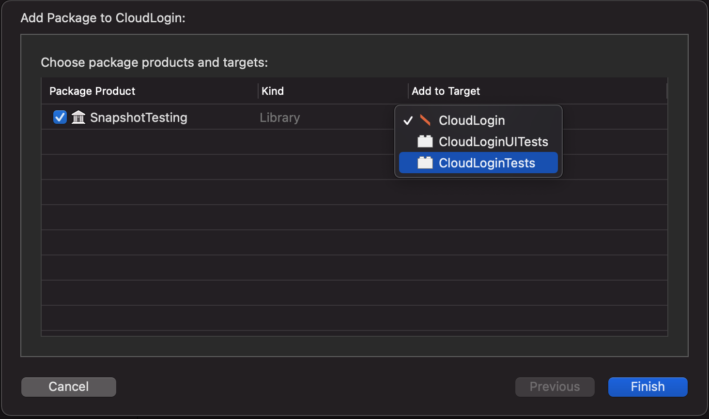

#  Snapshot UI Testing

### Dependecies: 

[SnapshotTesting - Delightful Swift snapshot testing ](https://github.com/pointfreeco/swift-snapshot-testing.git)

include SnapshotTesting to your project via Swift Package Manager from the following repo [https://github.com/pointfreeco/swift-snapshot-testing.git](https://github.com/pointfreeco/swift-snapshot-testing.git)

```
dependencies: [
  .package(name: "SnapshotTesting", url: "https://github.com/pointfreeco/swift-snapshot-testing.git", from: "1.8.1"),
]
```

> &#	1F4DD; **TLDR:**
> Use Swift Snapshot and assert anything not just images. iOSSnapshotTestCase still worksbut only if you use a community derived fork.
> Lfyt following in ubers footsteps have released their version called Hammer, give it a try.

SnapshotTesting allows the addition of snapshotting text and other types not limited to just images. To snapshot  test a image first import the library to your test case target.

## SnapshotTesting

If importing to Xcode via SPM, you must enusre you apply it to your test target only. Select your Unit Test test target and hit continue. Once the library is imported there are no further configuration steps needed.
//// CHANGE THIS SCREEN SHOT! ////


Add the SnapShot test library to your Unit test class via `@import SnapshotTesting` , add a testable import of your project `@testable import CloudLogin` and since `CloudLogin is a SwiftUI project, we will also import the SwiftUI package.

```
import XCTest
import SwiftUI
import SnapshotTesting
@testable import CloudLogin
class CloudLoginTests: XCTestCase {
```
#### Running your first SnapshopTest

Creat a snapshot of your app screen by first loading the View and recording the screen. This is done by setting a global attribute `isRecording` to true.

You can set this up in the `setUpWithError()` function of the test to control it globally for the Unit test class.  You can also set `isRecording` at the function level or the individual assertion as a optional parameter.
> Replace all snapshot images for each assertSnapshot in your test class
```
override func setUpWithError() throws {
    isRecording = true
}
```

> replace at the function level
```
func testExample() -> throws {
    var sut = SignupScreenView()
    isRecording = true
}
```
> assertion level
```
assertSnapshot(matching: viewController, as: .image(on: .iPhoneSe), record: true )
```
There isn't any thing further to test at this point as your test will always fail when isRecording is test to true. The framework will also throw a error remidning you to turn this off for running test.

After running with `isRecording = true` a __Snapshots__ folder is generated at the path of your test file.  

Set isRecording to false and assert your view using assertSnapshot with the assertion strategy type of  `image`.

learn more about assertion strategies here -> 

> When creating a new snapshot verify the image is correct before proceeding. 
> Due to the nature of snapshot testing a 'true' result will be the initally recorded image captured, if this is incorrect to begin with all future assertion will be falsely identified as passing. 

A handy feature of the image assertion strategy is the ability to render for a specific device size, this is done by using the optional paramerter `on` when defining the assertion strategy type.

```
assertSnapshot(matching: viewController, as: .image(on: .iPhoneSe))
```
You are able to also snapshot test a particular reference size of your image

### Use GIT LFS
after a while we may need to extract the images to S3, using GIT LFS to reference a pointer to the UI Test images.

### To be considered
There's a pitfall that a failed snapshot tests may just be updated to the new screenshot `isRecording = true` without true knowledge why the previous test failed.

Github repo size increases.

When testing SwiftUI extract your data level to account for the state change in SWIFTUI, (A SwiftUI view can be both presentation layer and app state)

## Hammer

### The new kid on the block, Hammer
lyft/Hammer was launched week of July 12/2021 during the time of writing, I decided to spend the extra time and tack the library on as well.

https://t.co/VUWunH6KDK

## iOSSnapshotTestCase

### Background: 

[iOSSnapshotTestCase](https://github.com/uber/ios-snapshot-test-case/)

Originally developed by Facebook, iOS Snapshot Test Case allowed assertion of your UI during  XCTUITest by comparing a screenshot of your app. The ownership of the repo then passed to Uber however it is no longer maintained by Uber. One of the top contributers [@alanzeino](https://github.com/alanzeino) who help facillate Uber taking ownership of iOS Snapshot Test Case from facebook. Ironically he's no longer at Uber and works for FB has pointed many users to the SnapshotTesting repo. Additionally there are further community changes needed to allow iOS Snapshot Test Case to run in Xcode 12, `@alanzeino` has stated he is attempting to gain ownership to the repo. A working fork of iOS Snapshot Test Case can be found on his github[iOS Snapshot Test Case - active fork](https://github.com/alanzeino/ios-snapshot-test-case). 

### Installing:

Implementing snapshot testing with iOSSnapshotTestCase. Add the dependency `https://github.com/alanzeino/ios-snapshot-test-case.git` to SPM via xcode or directly in the Packages.swift file. 


```
dependencies: [
  .package(url: "https://github.com/uber/ios-snapshot-test-case.git", .exact("6.2.1")),
]
```

After including the library you must configure it as it is a Linked library your project will fail to compile until you do. As per the documentation. 

include the following Enviornment variables,

| Name | Value |
| :------- | :------- |
| FB_REFERENCE_IMAGE_DIR | $(SOURCE_ROOT)/$(PROJECT_NAME)Tests/ReferenceImages |
| IMAGE_DIFF_DIR | $(SOURCE_ROOT)/$(PROJECT_NAME)Tests/FailureDiffs |

This folders must now be manually created for the project to correctly compile and run. 

Next create a test that extends from `FBSnapshotTestCase` instead of  `XCTest`

### A SwiftUI problem? No a UITestCase problem

I was unable to run this library, there was warnings about a core component missing which was listed as imported by the framework.
Library not evaluated
